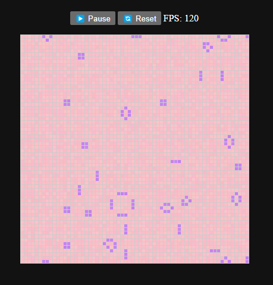

# 🦥 Game of Life — Magical Forest Edition

A soothing, pixel-perfect WebAssembly simulation of Conway's Game of Life — reimagined with cozy colors, gentle motion, and magical mossy vibes.

## 🌟 Features
- Soft randomized colors for alive/dead cells
- Pause / resume & reset controls
- FPS meter to monitor performance
- Toggle visibility via `<details>` block
- Responsive, embeddable & fast

## 📦 Build Instructions

```bash
wasm-pack build --target web
cd www
npx serve
```

## 🧠 Future Ideas
- Click to toggle cells
- Import/export patterns
- Sprites and trails
- Cellular automata variants

## 🖼️ Preview



## ❤️ Credits
Built by [Slothly Sage](https://slothlysage.com) — cultivating the magic in humanity reflected through technology.
